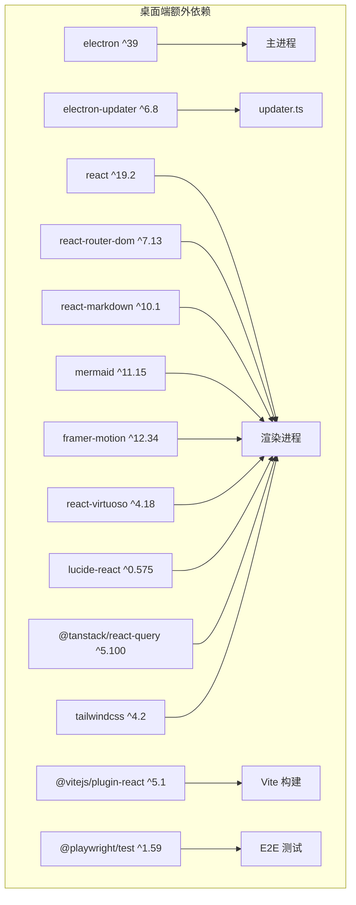

# xiaok-cli 代码库结构概览与依赖分析

> **生成时间**: 2026-06-03  
> **项目**: xiaok-cli (xiaokcode v1.3.14)  
> **描述**: 本地优先的 AI 任务交付工作台 CLI + Electron 桌面客户端  
> **许可证**: Apache-2.0  
> **仓库**: https://github.com/kaisersong/xiaok-cli

---

## 一、仓库顶层结构

```
xiaok-cli/
├── src/                     # CLI 核心源码 (TypeScript, ~318 文件)
├── desktop/                 # Electron 桌面端 (独立子项目)
│   ├── electron/            #   主进程源码 (TypeScript, ~50 文件)
│   ├── renderer/            #   渲染进程 (React UI)
│   ├── build/               #   图标资源
│   ├── scripts/             #   构建脚本
│   └── tests/               #   桌面端测试
├── tests/                   # CLI 测试套件 (~260+ 测试文件)
├── scripts/                 # 构建/CI/评估工具脚本 (~22 文件)
├── data/                    # 内置 Skill/Agent 定义数据
├── evals/                   # 评估用例集 (prompt CSV, cases JSON)
├── dist/                    # 编译产物 (tsc output)
├── docs -> ../mydocs/xiaok-cli   # 文档软链接
├── reviews/                 # 代码审查记录
├── artifacts/               # 项目产物目录
├── .worktrees/              # Git worktree 管理
├── .xiaok/                  # xiaok 运行时状态目录
├── .gstack/                 # gstack 工具状态
├── benchmark/               # 基准测试
└── 配置文件 ...
```

---

## 二、核心模块划分

### 2.1 CLI 入口链

```
index.html (Electron renderer 入口)
  └─ src/index.ts (CLI shebang 入口)
       └─ src/main.ts (Commander CLI 路由注册)
            ├─ 注册 14 个命令模块
            └─ 崩溃报告全局安装
```

| 入口文件 | 类型 | 说明 |
|---------|------|------|
| `src/index.ts` | CLI 入口 | shebang → 安装警告过滤器 → 动态 import main.ts |
| `src/main.ts` | CLI 主路由 | Commander 程序注册全部命令 |
| `index.html` | Electron 渲染入口 | 桌面端渲染进程入口 |
| `desktop/electron/main.ts` | Electron 主进程入口 | app ready → 窗口/托盘/更新器/KSwarm 服务 |
| `preload.cjs` | Electron 预加载 | 桥接 API 暴露给渲染进程 |
| `main.js` | Electron 主进程 bundle | 编译后的主进程入口 (desktop-services 整合) |

### 2.2 CLI 命令模块 (`src/commands/`)

14 个命令模块，通过 Commander 注册：

| 模块 | 文件 | CLI 命令 |
|------|------|---------|
| `auth` | `auth.ts` | 认证/登录 |
| `chat` | `chat.ts` | 默认交互对话 |
| `config` | `config.ts` | 配置管理 |
| `commit` | `commit.ts` | Git 提交通道 |
| `doctor` | `doctor.ts` | 系统诊断 |
| `init` | `init.ts` | 项目初始化 |
| `pr` | `pr.ts` | PR 管理 |
| `reminder` | `reminder.ts` | 定时提醒守护进程 |
| `review` | `review.ts` | 代码审查 |
| `transcript` | `transcript.ts` | 对话记录 |
| `yzj` | `yzj.ts` | 云之家通道 |
| `plugin` | `plugin.ts` | 插件管理 |
| `memory` | `memory.ts` | 记忆管理 |
| `diagnose` | `diagnose.ts` | 问题诊断 |
| `trace-export` | `trace-export.ts` | 追踪导出 |

辅助命令文件：
| 文件 | 职责 |
|------|------|
| `chat-print-mode.ts` | 打印模式 |
| `chat-reminder.ts` | 对话提醒 |
| `chat-shell-escape.ts` | Shell 转义 |
| `yzj-safe-tools.ts` | 云之家安全工具集 |
| `registry.ts` | 命令注册表 |

### 2.3 AI 核心层 (`src/ai/`)

**运行时 (runtime)**：
| 文件 | 职责 |
|------|------|
| `controller.ts` | 主控制器：turn loop、context 加载、agent 编排 |
| `agent-runtime.ts` | Agent 执行引擎 |
| `runtime-facade.ts` | 对外 Facade |
| `session.ts` / `session-graph.ts` | 会话管理与有向图 |
| `session-store/` | 多后端存储：`sqlite-store.ts`、`file-store.ts`、`store.ts` |
| `context-loader.ts` | 上下文注入 |
| `compact-runner.ts` | 上下文压缩 |
| `usage.ts` | Token 用量追踪 |
| `model-capabilities.ts` | 模型能力查询 |
| `blocks.ts` / `events.ts` / `runtime-errors.ts` | 流式块、事件总线、错误类型 |

**适配器 (adapters)**：
| 文件 | 职责 |
|------|------|
| `claude.ts` | Anthropic Claude API 适配 |
| `openai.ts` | OpenAI Chat Completions API |
| `openai-responses.ts` | OpenAI Responses API (新) |

**工具系统 (tools)**：
| 文件 | 职责 |
|------|------|
| `index.ts` | 工具列表构建、统一调度 |
| `bash.ts` (+ `bash-safety.ts`) | Shell 执行 + 安全检查 |
| `read.ts` / `write.ts` / `edit.ts` | 文件操作 |
| `glob.ts` / `grep.ts` | 文件搜索 |
| `web-fetch.ts` / `web-search.ts` | 网络请求/搜索 |
| `install-skill.ts` / `uninstall-skill.ts` / `validate-skill.ts` | Skill 管理 |
| `ask-user.ts` / `ask-user-question.ts` | 用户交互 |
| `notebook.ts` | 笔记本/长期记忆 |
| `reminders.ts` | 提醒管理 |
| `lsp.ts` | LSP 工具 |
| `computer-use.ts` | Computer Use (CUA) |
| `subagent.ts` | 子代理调用 |
| `intent-delegation.ts` | 意图委派工具 |
| `search.ts` | 工具搜索 |
| `truncation.ts` | 输出截断 |
| `validate-input.ts` | 输入校验 |
| `connectors/` | 搜索/抓取连接器 (Jina, Brave, DuckDuckGo, Tavily) |

**记忆系统 (memory)**：
| 文件 | 职责 |
|------|------|
| `store.ts` | 主存储接口 (SQLite + 向量) |
| `layered-store.ts` | 分层记忆 |
| `embedding.ts` | 内容向量化 |
| `onnx-engine.ts` | ONNX 本地推理引擎 |
| `retrieval.ts` | 向量检索 |
| `compaction.ts` | 记忆压缩 |
| `segment.ts` | 分段策略 |
| `model-registry.ts` | 嵌入模型注册 |
| `migrations.ts` | 数据结构迁移 |

**意图委派 (intent-delegation)**：
| 文件 | 职责 |
|------|------|
| `planner.ts` | 意图规划 |
| `matcher.ts` | Skill 匹配 |
| `boundary-classifier.ts` | 边界分类器 |
| `boundary-resolver.ts` | 边界决策 |
| `boundary-validator.ts` | 边界校验 |
| `llm-boundary-classifier.ts` | LLM 分类 |
| `path-contract.ts` | 路径契约 |
| `templates.ts` | Prompt 模板 |

**Skill 系统 (skills)**：
| 文件 | 职责 |
|------|------|
| `loader.ts` | Skill 加载 |
| `tool.ts` | Skill 工具桥接 |
| `planner.ts` | Skill 规划 |
| `quality.ts` | 质量检查 |
| `compliance.ts` | 合规校验 |
| `watcher.ts` | 文件监控热加载 |
| `defaults.ts` | 默认 Skill |
| `execution-state.ts` | 执行状态 |

**Prompt 构建 (prompts)**：
| 文件 | 职责 |
|------|------|
| `builder.ts` | Prompt 组装 |
| `assembler.ts` | 各部分组合 |
| `sections/` | 15 个 prompt 模板片段 |

**Provider 管理 (providers)**：
| 文件 | 职责 |
|------|------|
| `registry.ts` | Provider 注册 |
| `control-plane.ts` | 控制平面 |
| `normalize.ts` | 标准化 |
| `model-binding.ts` | 模型绑定 |
| `auth-resolver.ts` | 认证解析 |

**MCP 集成 (mcp)**：
| 文件 | 职责 |
|------|------|
| `client.ts` | MCP 客户端 |
| `runtime/client.ts` | 运行时 MCP 客户端 |
| `runtime/server-process.ts` | MCP 服务进程管理 |
| `runtime/tools.ts` | MCP 工具发现 |

**权限系统 (permissions)**：
| 文件 | 职责 |
|------|------|
| `manager.ts` | 权限管理器 |
| `policy-engine.ts` | 策略引擎 |
| `workspace.ts` | 工作区权限 |
| `settings.ts` | 权限设置 |
| `sensitive-paths.ts` | 敏感路径 |

**子代理系统 (agents)**：
| 文件 | 职责 |
|------|------|
| `subagent.ts` | 子代理定义 |
| `subagent-executor.ts` | 子代理执行器 |
| `loader.ts` | 子代理加载 |

### 2.4 运行时层 (`src/runtime/`)

| 目录 | 职责 |
|------|------|
| `reminder/` | 定时提醒守护进程：`daemon.ts`、`store.ts`、`scheduler.ts`、`parser.ts`、`notifier.ts`、`client.ts`、IPC 等 |
| `task-host/` | KSwarm 任务宿主：`task-runtime-host.ts`、`deliverable-gate.ts`、`material-registry.ts`、`snapshot-store.ts`、`event-projection.ts` 等 |
| `tasking/` | 任务管理系统：`manager.ts`、`store.ts`、`board.ts`、`runtime-sync.ts` |
| `intent-delegation/` | 意图委派运行时：`dispatcher.ts`、`handoff.ts`、`skill-eval.ts`、`skill-score-store.ts`、`ownership.ts` |
| `guards/` | 守卫策略：artifact-evidence、recovery-continuity、protected-output、verification-before-completion |
| `daemon/` | 守护进程管理：`host.ts`、`launcher.ts`、`control.ts`、`protocol.ts` |
| `diagnostics/` | 诊断系统：`diagnoser.ts`、`project-diagnoser.ts` |
| `evals/` | 评估引擎：`ahe-lite-runner.ts`、`baseline.ts`、`live-smoke-gate.ts` |
| `trace/` | 执行追踪：`runtime-recorder.ts`、`normalizer.ts`、`redactor.ts`、`exporter.ts`、`writer.ts` |
| `harness-memory/` | 测试 harness 记忆：`store.ts`、`promotion.ts` |
| `materials/` | 材料提取：`text-extractor.ts` |
| `skills/` | 运行时 Skill 状态：`adherence-store.ts` |
| `stage/` | 阶段执行：`executor.ts`、`types.ts` |
| `events.ts` | 运行时事件总线 |
| `hooks.ts` / `hooks-runner.ts` | 生命周期钩子系统 |
| `warnings.ts` | 警告过滤器 |

### 2.5 平台层 (`src/platform/`)

| 目录 | 职责 |
|------|------|
| `runtime/` | 平台运行时：`capability-registry.ts`、`context.ts`、`health-store.ts`、`registry-factory.ts` |
| `plugins/` | 插件系统：`loader.ts`、`manifest.ts`、`runtime.ts` (Skill → Plugin 迁移架构) |
| `mcp/` | MCP 平台：`config.ts`、`transport.ts`、`server-classification.ts`、`cua-connection-manager.ts` |
| `lsp/` | LSP 集成：`client.ts`、`manager.ts`、`server-process.ts` |
| `sandbox/` | 沙箱：`enforcer.ts`、`policy.ts`、`tool-wrappers.ts` |
| `agents/` | 后台 runner：`background-runner.ts` |
| `teams/` | 团队协作：`service.ts`、`store.ts`、`tools.ts` |
| `worktrees/` | Git worktree：`manager.ts` |

### 2.6 通道层 (`src/channels/`)

多通道消息系统，支持外部平台集成：

| 文件 | 通道 |
|------|------|
| `yzj*.ts` (9 文件) | 云之家 (Kingdee YZJ)：WebSocket、Webhook、签名、去重、传输 |
| `discord.ts` | Discord |
| `slack.ts` | Slack |
| `telegram.ts` | Telegram |
| `webhook.ts` | 通用 Webhook |
| `embedded-channel.ts` / `embedded-yzj.ts` | 嵌入式通道 |
| `worker.ts` | 通道 Worker |
| `task-manager.ts` / `task-store.ts` | 通道任务管理 |
| `agent-service.ts` | 通道代理服务 |
| `notifier.ts` | 通知器 |
| `session-store.ts` / `session-binding-store.ts` / `session-runtime-snapshot.ts` | 会话绑定 |
| `approval-store.ts` / `reply-target-store.ts` | 审批与回复 |

### 2.7 UI 终端层 (`src/ui/`)

~35 个文件，实现全功能 TUI 界面：

| 类别 | 文件 |
|------|------|
| 输入系统 | `input.ts`、`input-engine.ts`、`input-editor.ts`、`input-model.ts`、`input-paste.ts`、`file-completions.ts` |
| 渲染 | `render.ts`、`markdown.ts`、`highlight.ts`、`terminal-renderer.ts`、`repl-renderer.ts`、`turn-layout.ts` |
| 交互 | `ask-question.ts`、`permission-prompt.ts`、`keybindings.ts`、`scroll-region.ts`、`tool-explorer.ts` |
| 状态管理 | `surface-state.ts`、`overlay-state.ts`、`modal-state.ts`、`repl-state.ts`、`queued-input.ts` |
| 终端 | `terminal-controller.ts`、`terminal-frame.ts`、`text-metrics.ts`、`display-width.ts` |
| 其他 | `image-input.ts`、`model-selector.ts`、`channel-selector.ts`、`statusbar.ts`、`transcript.ts`、`orchestration.ts`、`locale.ts` |
| TUI 运行时 | `tui/runtime-state.ts` |

### 2.8 工具库 (`src/utils/`)

| 文件 | 职责 |
|------|------|
| `config.ts` | 配置管理 |
| `git.ts` | Git 操作 |
| `crash-reporter.ts` | 崩溃报告 |
| `logger.ts` | 日志（结构化） |
| `clipboard.ts` | 剪贴板 |
| `ui.ts` | UI 辅助 |
| `external-docs.ts` | 外部文档引用检查 |
| `pid-lock.ts` | PID 文件锁 |

### 2.9 其他模块

| 目录 | 文件数 | 职责 |
|------|--------|------|
| `src/auth/` | 3 文件 | 认证：`identity.ts`、`login.ts`、`token-store.ts` |
| `src/update/` | 3 文件 | 更新检测：`version-check.ts`、`source-detection.ts`、`types.ts` |
| `src/quality/` | 3 文件 | 质量检查：`artifact-smoke.ts`、`harness-manifest.ts`、`regression-capture.ts` |
| `src/build-info.ts` | 1 文件 | 构建时间戳（自动生成） |

---

## 三、Desktop 桌面端 (`desktop/`)

独立 Electron 子项目，共享 CLI 核心代码：

### 3.1 架构层次

```
desktop/
├── electron/    # 主进程 (Electron main process)
├── renderer/    # 渲染进程 (React + Vite + Tailwind)
├── shared/      # 主/渲染进程共享代码
├── build/       # 应用图标 (icns/ico/png)
└── scripts/     # 构建脚本
```

### 3.2 Electron 主进程模块 (`desktop/electron/`, ~50 文件)

| 模块 | 职责 |
|------|------|
| `main.ts` | 进程入口 |
| `ipc.ts` | IPC 通信 |
| `managed-xiaok-agent.ts` | xiaok 代理进程管理 |
| `skill-runtime.ts` | Skill 运行时 |
| `context-manager.ts` | 上下文管理 |
| `user-memory.ts` | 用户记忆 |
| `desktop-services.ts` | 桌面服务整合 |
| **KSwarm 系统** | |
| `kswarm-service.ts` | KSwarm 服务 |
| `kswarm-runtime-bridge.ts` | 运行时桥接 |
| `kswarm-project-tool.ts` | 项目工具 |
| `kswarm-dynamic-workflow-script-tool.ts` | 动态工作流 |
| `kswarm-initial-plan-bootstrap.ts` | 初始计划引导 |
| `workflow-script-contract.ts` / `workflow-script-runtime.ts` / `workflow-script-kswarm-controller.ts` | 工作流脚本引擎 |
| **定时动作系统** | |
| `timed-action-service.ts` / `timed-action-scheduler.ts` / `timed-action-store.ts` / `timed-action-trigger.ts` / `timed-action-types.ts` / `timed-action-executors.ts` | 提醒 + 定时任务 |
| **其他服务** | |
| `connectors-service.ts` / `connectors-store.ts` | 连接器 |
| `computer-use-capability-service.ts` | CUA 能力 |
| `cua-driver-manager.ts` | CUA 驱动 |
| `plugin-dependency-service.ts` | 插件依赖 |
| `principles-store.ts` | 原则存储 |
| `project-digest.ts` | 项目摘要 |
| `artifact-sdk.ts` / `artifact-editing.ts` | 产物 SDK |
| `python-runtime.ts` | Python 运行时 |
| `updater.ts` | 自动更新 |
| `menubar.ts` | 菜单栏/托盘 |
| `window-lifecycle.ts` / `window-icon.ts` | 窗口管理 |
| `desktop-notifications.ts` | 桌面通知 |
| `reminder-store.ts` / `reminder-scheduler.ts` / `scheduled-task-scheduler.ts` | 提醒调度 |
| `security.ts` | 安全策略 |
| `context-menu.ts` | 右键菜单 |
| `deploy-bundled-plugins.ts` | 插件部署 |
| `intent-broker-protocol.ts` | 意图代理协议 |
| `memory-import-parser.ts` | 记忆导入解析 |
| `preload.ts` / `preload-api.ts` / `preload.cjs` | 预加载桥接 |

### 3.3 渲染进程 (`desktop/renderer/`)

React 19 + TypeScript + Vite 7 + Tailwind CSS 4 前端架构：

- **路由**: react-router-dom v7
- **UI 组件**: lucide-react 图标库
- **渲染**: react-markdown + remark-gfm + rehype-highlight + rehype-katex（支持 GFM、代码高亮、数学公式）
- **可视化**: mermaid 11.x 图表
- **虚拟列表**: react-virtuoso
- **动画**: framer-motion
- **查询**: @tanstack/react-query

---

## 四、配置文件清单

| 文件 | 类型 | 用途 |
|------|------|------|
| `package.json` (root) | NPM | CLI 项目配置、脚本、运行时依赖 (ESM) |
| `package.json` (desktop) | NPM | 桌面端子项目、Electron 依赖 |
| `tsconfig.json` | TS | CLI 编译：ES2022/NodeNext/严格模式 |
| `tsconfig.tests.json` | TS | 测试文件编译 (输出到 .test-dist) |
| `desktop/tsconfig.base.json` | TS | 桌面端基础配置 |
| `desktop/tsconfig.electron.json` | TS | 主进程编译 |
| `desktop/tsconfig.renderer.json` | TS | 渲染进程编译 |
| `vitest.config.ts` | Vitest | 单元测试全局配置 |
| `vitest.sandbox.config.mjs` | Vitest | 沙箱测试配置 |
| `vitest.skill-release.config.mjs` | Vitest | Skill 发布测试配置 |
| `desktop/vitest.config.ts` | Vitest | 桌面端测试 |
| `desktop/playwright.e2e.config.ts` | Playwright | E2E 测试 |
| `desktop/vite.config.ts` | Vite | 渲染进程构建 |
| `desktop/electron-builder.json` | Electron Builder | 打包配置 |
| `desktop/react-doctor.config.json` | React Doctor | React 代码质量 |
| `.gitignore` | Git | 忽略规则 |
| `.github/workflows/` | CI | GitHub Actions |
| `.githooks/pre-commit` | Git | pre-commit: 外部文档检查 |
| `LICENSE` | 法律 | Apache-2.0 |
| `BRIEF.json` | 元数据 | 最新演示文稿 brief |

---

## 五、运行时依赖拓扑

### 5.1 CLI 核心依赖

```mermaid
graph TD
    A["@anthropic-ai/sdk ^0.39"] --> CLAUDE["src/ai/adapters/claude.ts"]
    B["openai ^4.77"] --> OPENAI["src/ai/adapters/openai.ts"]
    C["commander ^12.0"] --> MAIN["src/main.ts"]
    D["better-sqlite3 ^12.10"] --> STORE["session-store + memory"]
    E["@modelcontextprotocol/sdk ^1.29"] --> MCP["src/ai/mcp/ + src/platform/mcp/"]
    F["fast-glob ^3.3"] --> GLOB["src/ai/tools/glob.ts"]
    G["onnxruntime-node ^1.26"] --> ONNX["src/ai/memory/onnx-engine.ts"]
    H["@huggingface/tokenizers ^0.1"] --> TOKEN["src/ai/memory/segment.ts"]
    I["beautiful-mermaid ^1.1"] --> MD["src/ui/markdown.ts"]
    J["ws ^8.21"] --> YZJ["src/channels/yzj-websocket*.ts"]
    K["lodash-es ^4.17"] --> UTILS["utils/*"]
    L["nodejieba ^3.5 (optional)"] --> SEG["中文分词 - memory"]

    style A fill:#ff6b35,stroke:#333
    style B fill:#10a37f,stroke:#333
    style C fill:#d4a373,stroke:#333
    style D fill:#8ecae6,stroke:#333
    style E fill:#219ebc,stroke:#333
```



### 5.2 Desktop 特有依赖



### 5.3 开发依赖

| 依赖 | 用途 |
|------|------|
| `typescript ^5.7` | 编译器 |
| `vitest ^3.0` | 测试框架 |
| `tsx ^4.19` | 开发时 TS 执行 |
| `@types/better-sqlite3` | 类型声明 |
| `@types/node ^22.0` | Node.js 类型 |
| `@types/lodash-es` | 类型声明 |
| `@types/ws` | WebSocket 类型 |

### 5.4 模块依赖拓扑 (高级)

```mermaid
graph TD
    ENTRY["index.ts → main.ts"] --> CMDS["commands/ (14 模块)"]
    ENTRY --> RUNTIME["runtime/warnings.ts"]
    
    CMDS --> AI["src/ai/"]
    CMDS --> CHANNELS["src/channels/"]
    CMDS --> PLATFORM["src/platform/"]
    CMDS --> UTILS["src/utils/"]
    CMDS --> AUTH["src/auth/"]
    CMDS --> RUNTIME
    
    AI --> ADAPTERS["adapters/ (claude, openai)"]
    AI --> TOOLS["tools/ (25+ tools)"]
    AI --> MEMORY["memory/ (10 files)"]
    AI --> PROMPTS["prompts/ (builder + 15 sections)"]
    AI --> SKILLS["skills/ (8 files)"]
    AI --> INTENT["intent-delegation/ (10 files)"]
    AI --> PROVIDERS["providers/ (5 files)"]
    AI --> MCP_AI["mcp/ (4 files)"]
    AI --> AGENTS["agents/ (3 files)"]
    AI --> PERMISSIONS["permissions/ (5 files)"]
    AI --> SESSION["runtime/ (controller, session, context, etc)"]
    
    SESSION --> STORE["session-store/ (sqlite, file, abstract)"]
    TOOLS --> CONNECTORS["connectors/ (fetch + search providers)"]
    
    RUNTIME --> REMINDER["reminder/ (14 files)"]
    RUNTIME --> TASK_HOST["task-host/ (10 files)"]
    RUNTIME --> TASKING["tasking/ (5 files)"]
    RUNTIME --> INTENT_RT["intent-delegation/ (10 files)"]
    RUNTIME --> GUARDS["guards/ (5 files)"]
    RUNTIME --> DAEMON["daemon/ (4 files)"]
    RUNTIME --> TRACE["trace/ (6 files)"]
    RUNTIME --> EVALS["evals/ (4 files)"]
    RUNTIME --> DIAGNOSTICS["diagnostics/ (3 files)"]
    
    PLATFORM --> PLUGINS["plugins/ (3 files)"]
    PLATFORM --> MCP_PLAT["mcp/ (5 files)"]
    PLATFORM --> LSP["lsp/ (3 files)"]
    PLATFORM --> SANDBOX["sandbox/ (3 files)"]
    PLATFORM --> TEAMS["teams/ (3 files)"]
    PLATFORM --> WORKTREES["worktrees/ (1 file)"]
    
    CHANNELS --> YZJ["yzj* (9 files)"]
    CHANNELS --> EXTERNAL["discord, slack, telegram, webhook"]
    CHANNELS --> CHANNEL_RT["worker, task-manager, session-*"]
    
    UI["src/ui/ (35 files)"] --> CMDS
    UTILS --> CMDS
    UPDATE["src/update/ (3 files)"] --> CMDS
    QUALITY["src/quality/ (3 files)"] --> CMDS

    style ENTRY fill:#e76f51,stroke:#333,color:white
    style AI fill:#2a9d8f,stroke:#333,color:white
    style RUNTIME fill:#264653,stroke:#333,color:white
    style PLATFORM fill:#e9c46a,stroke:#333
    style CHANNELS fill:#f4a261,stroke:#333
    style CMDS fill:#6d6875,stroke:#333,color:white
```



---

## 六、关键统计

| 指标 | 数值 |
|------|------|
| TypeScript 源文件总数 | ~318 (src/) + ~50 (desktop/electron/) |
| 测试文件总数 | ~260+ (tests/) + ~25 (desktop E2E) |
| CLI 命令数 | 14 |
| AI 工具数 | 25+ |
| 支持的 LLM Provider | 3 (Claude, OpenAI Chat, OpenAI Responses) |
| 消息通道 | 5+ (云之家、Discord、Slack、Telegram、Webhook) |
| 模块目录数 | ~50 |
| 运行时依赖 | 9 (+1 optional) |
| 桌面端额外运行时依赖 | 5 |
| 开发依赖 | 6 (CLI) + ~18 (Desktop) |
| Node.js 要求 | >=20 |
| 目标 ES 版本 | ES2022 |
| 模块系统 | NodeNext (ESM) |

---

## 七、数据与配置目录

| 目录 | 用途 |
|------|------|
| `data/agents/` | 内置 Agent 定义 (explore, plan, verification) |
| `data/skills/` | 内置 Skill 定义 (debug, keybindings, plan, project, review, simplify, skill-creator, update-config) |
| `data/yzj-api-overview.md` | 云之家 API 参考 |
| `.xiaok/` | xiaok 运行时状态（skills, state, evals, spill） |
| `.gstack/` | gstack 浏览器审计日志 |
| `.worktrees/` | Git worktree 工作区 |
| `.governance-claims/` | KSwarm 治理声明 |

---

## 八、未覆盖与无法读取区域说明

| 区域 | 状态 | 原因 |
|------|------|------|
| `node_modules/` | 排除 | NPM 依赖，非项目源码 |
| `desktop/node_modules/` | 排除 | 同上 |
| `dist/` | 排除 | 编译产物，可通过 `tsc` 重建 |
| `desktop/dist/` | 排除 | 同上 |
| `.git/` | 排除 | Git 版本控制数据 |
| `.test-dist/` / `.test-cache/` | 排除 | 测试临时文件 |
| `desktop/renderer/src/` | 未详细列出 | 目录结构已覆盖，详细文件列表可后续补充 |
| `docs/` (symlink) | 未追踪 | 软链接到外部 mydocs 目录 |
| `release/` | 未追踪 | 发布产物目录 |

---

## 九、架构特征总结

1. **双层架构**：CLI (`src/`) + Desktop (`desktop/`)，共享 AI 核心逻辑
2. **模块化层次分明**：ai/platform/runtime/channels/ui 五层解耦
3. **Provider 抽象**：Claude / OpenAI 双适配器，通过 control-plane 统一管理
4. **工具系统可扩展**：`buildToolList()` 工厂模式 + connector 插件化
5. **Skill → Plugin 架构演进**：从 prompt-heavy 单体到 IR + MCP Server 的职责分离
6. **多通道消息**：云之家、Discord、Slack、Telegram 统一抽象
7. **守卫策略链**：artifact-evidence/recovery-continuity/verification 多层保障
8. **KSwarm 集成**：完整的项目创建、编排、workflow 执行和运行时桥接
9. **桌面端特性**：定时动作调度器、系统托盘、自动更新、CUA 驱动管理
10. **测试覆盖广泛**：260+ 测试文件覆盖 ai/platform/runtime/ui/commands/tools 全栈
