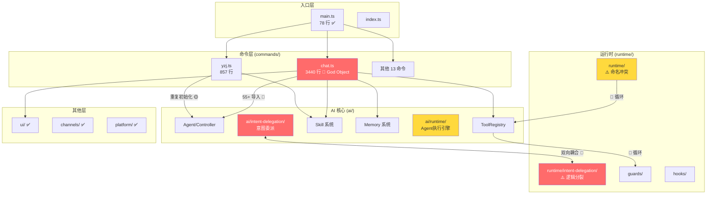

# 模块化与关注点分离评审

> **项目**: xiaok-cli (xiaokcode v1.3.14)
> **评审维度**: Phase 2 — 架构与设计评审
> **评审日期**: 2026-06-03
> **依据来源**: phase-1 产物（代码库结构概览与依赖分析） + 源码深度遍历

---

## 一、总体结论

| 维度 | 评分 | 说明 |
|------|------|------|
| 模块划分清晰度 | ⚠️ 中等 | 9 大模块划分基本合理，但 `ai/runtime/` 与 `runtime/` 语义重叠 |
| 耦合度 | ⚠️ 中等 | `commands/` ↔ `ai/` 高度耦合，`ai/` ↔ `runtime/` 存在循环依赖 |
| 接口抽象 | ⚠️ 中等 | `RuntimeFacade` 存在但被大量绕过；命令层直接访问 AI 内部实现 |
| 单一职责 | 🔴 需改进 | `chat.ts`（3440 行）是明显的 God Object |
| 循环依赖 | 🔴 存在 | `ai/` ↔ `runtime/` 双向依赖已验证 |
| 整体评价 | ⚠️ 可维护但有债务 | 模块边界模糊、命令层过重、存在循环依赖需治理 |

---

## 二、模块职责分布

### 2.1 模块清单与职责

| 模块 | 文件数 | 声明职责 | 实际职责 |
|------|--------|---------|---------|
| `src/commands/` | 20 | CLI 命令定义与路由 | ⚠️ **超载**：直接编排 AI 运行时、技能系统、权限、意图委派、UI 渲染 |
| `src/ai/` | 119 | AI 核心：运行时、工具、记忆、技能 | ✅ 基本符合，但部分逻辑泄漏到 `runtime/` |
| `src/ui/` | 34 | TUI 终端界面 | ✅ 职责清晰，仅 UI 渲染与交互 |
| `src/channels/` | 28 | 外部消息通道连接 | ✅ 职责清晰，通道适配与消息路由 |
| `src/runtime/` | 73 | 运行时：提醒、任务宿主、意图委派、守卫 | ⚠️ 与 `ai/runtime/` 语义重叠，职责边界模糊 |
| `src/platform/` | 23 | 平台：插件、MCP、LSP、沙箱 | ✅ 职责清晰 |
| `src/auth/` | 3 | 认证与 Token 管理 | ✅ 职责清晰 |
| `src/utils/` | 8 | 通用工具（配置、日志、Git、崩溃报告） | ✅ 职责清晰 |
| `src/quality/` | 3 | 质量：产物冒烟、Harness 清单 | ✅ 职责清晰 |
| `desktop/electron/` | ~50 | Electron 主进程服务 | ⚠️ 与 `src/` 共享 KSwarm、定时动作等逻辑 |

### 2.2 边界模糊问题

**问题 1: `ai/runtime/` vs `runtime/` 命名冲突**

```
src/ai/runtime/       ← AI 执行引擎（AgentRuntime, controller, session, context-loader）
src/runtime/          ← 高层运行时（hooks, guards, stage, intent-delegation, reminder, trace）
```

两个目录都叫 "runtime"，但语义不同。`ai/runtime/` 是 AI Agent 回合执行层，`runtime/` 是进程级运行时服务和横切关注点。建议将 `ai/runtime/` 重命名为 `ai/execution/` 或 `ai/engine/`。

**问题 2: 意图委派逻辑分裂**

意图委派系统被拆分为两个目录：
- `src/ai/intent-delegation/`（AI 端：planner, matcher, boundary, templates, types）
- `src/runtime/intent-delegation/`（运行时端：dispatcher, handoff, skill-eval, store, sync）

且两个目录之间双向导入，耦合紧密：

```typescript
// 文件: src/ai/tools/intent-delegation.ts
import { applyIntentStepUpdate, recordStageArtifact } from '../../runtime/intent-delegation/dispatcher.js';
import { SessionIntentDelegationStore } from '../../runtime/intent-delegation/store.js';

// 文件: src/runtime/stage/executor.ts
import type { SkillMeta, SkillResourceEntry } from '../../ai/skills/loader.js';
import type { ToolRegistry } from '../../ai/tools/index.js';
import type { CustomAgentDef } from '../../ai/agents/loader.js';
```

**建议**：将意图委派系统合并到单一目录（如 `src/intent-delegation/`）或拆分为清晰的 API 层与实现层。

---

## 三、循环依赖分析

### 3.1 已验证的循环依赖链

```
src/ai/tools/intent-delegation.ts
  → src/runtime/intent-delegation/dispatcher.ts
    → (可能) src/runtime/stage/executor.ts
      → src/ai/skills/loader.ts
      → src/ai/tools/index.ts
        → 回到 ai/tools/
```

**完整依赖路径**：

```
ai/tools/index.ts
 └─ import { evaluateProtectedOutputGuard } from '../../runtime/guards/protected-output-guard.js'

runtime/stage/executor.ts
 └─ import type { SkillMeta } from '../../ai/skills/loader.js'
 └─ import type { ToolRegistry } from '../../ai/tools/index.js'

ai/runtime/agent-runtime.ts
 └─ import { evaluateVerificationBeforeCompletionGuard } from '../../runtime/guards/verification-before-completion-guard.js'

ai/prompts/builder.ts
 └─ import { JsonHarnessMemoryStore } from '../../runtime/harness-memory/store.js'
```

### 3.2 循环依赖影响

| 影响 | 严重程度 |
|------|---------|
| 模块初始化顺序不确定 | 🔴 高 |
| 重构时牵一发动全身 | 🟡 中 |
| Tree-shaking 失效，打包体积增大 | 🟡 中 |
| 单元测试隔离困难 | 🟡 中 |
| 阻止 `ai/` 作为独立 npm 包发布 | 🔴 高 |

### 3.3 单向依赖验证

**正确的单向依赖**（无反向引用）：
- ✅ `commands/` → `ai/`, `ui/`, `runtime/`, `utils/`（命令层依赖下层，正确方向）
- ✅ `ui/` → `ai/` (部分), `commands/registry`（UI 对命令注册表的引用较轻）
- ✅ `channels/` → `ai/`（通道层仅通过 RuntimeFacade 接口）
- ✅ `src/` ← 不被 `desktop/` 反向导入（✅）

**值得注意的耦合**：
- ⚠️ `ui/input.ts` 导入 `commands/registry.js`（`getChatSlashCommands`）：UI 层依赖命令层，逻辑上应该是命令层向 UI 提供接口，而非 UI 主动查询命令层

---

## 四、God Object 识别

### 4.1 `src/commands/chat.ts` — 3440 行

**证据**：chat.ts 是 xiaok-cli 中最大的文件（3440 行），承担了以下职责：

| 职责 | 代码行估算 | 应归属模块 |
|------|-----------|-----------|
| CLI 命令定义与参数解析 | ~50 行 | commands ✅ |
| AI 运行时初始化（Agent, PromptBuilder, MemoryStore, PermissionManager） | ~300 行 | ai/runtime |
| 工具注册表构建（ToolRegistry, ask-user, intent-delegation, skill tool） | ~150 行 | ai/tools |
| 意图委派系统初始化（boundary resolver, LLM classifier, skill eval, handoff） | ~200 行 | intent-delegation |
| Skill 系统初始化（loader, watcher, planner, compliance, execution-state） | ~200 行 | ai/skills |
| TUI 界面编排（MarkdownRenderer, StatusBar, ScrollRegion, InputReader, ReplRenderer, ToolExplorer, TurnLayout） | ~400 行 | ui |
| 会话管理（SessionStore, snapshot, hooks） | ~150 行 | ai/runtime |
| 对话主循环（turn loop, 流式输出, tool 执行, 上下文压缩） | ~800 行 | ai/runtime |
| 通道集成（session binding, approval flow） | ~100 行 | channels |
| 追踪与诊断 | ~80 行 | runtime/trace |
| 打印模式与输出格式 | ~100 行 | ui/commands |
| 文件操作、cd、上下文加载等辅助 | ~100 行 | 分散 |

**影响**：chat.ts 直接导入了 55+ 个不同模块，违反了单一职责原则。任何 AI 运行时、技能系统或 UI 组件的变更都可能需要修改此文件。

### 4.2 其他大型命令文件

| 文件 | 行数 | 问题 |
|------|------|------|
| `src/commands/yzj.ts` | 857 | 与 chat.ts 共享大量 AI 初始化逻辑（Agent, PromptBuilder, MemoryStore, PermissionManager 等），存在大量重复 |
| `src/ui/scroll-region.ts` | 1640 | 专用 UI 组件，行数偏高但职责单一，风险较低 |
| `src/ui/input.ts` | 1420 | TUI 输入处理，行数偏高但职责边界清晰 |

### 4.3 chat.ts 与 yzj.ts 的代码重复

chat.ts 和 yzj.ts 各自独立初始化了 **几乎相同的 AI 运行时栈**：

```typescript
// chat.ts 和 yzj.ts 中重复的初始化模式：
const adapter = createAdapter(config, model, ...);           // 两处
const agent = new Agent(adapter, tools, ...);                // 两处
const promptBuilder = new PromptBuilder(...);                // 两处
const permissionManager = new PermissionManager(...);        // 两处
const memoryStore = await createMemoryStoreAsync(...);       // 两处
const skillCatalog = await createSkillCatalog(...);          // 两处
// ... 更多重复
```

这种重复应通过提取共享的 "AI 运行时工厂" 来消除。

---

## 五、接口抽象评估

### 5.1 RuntimeFacade — 有接口但被绕过

`RuntimeFacade`（src/ai/runtime/runtime-facade.ts）设计为命令层与 AI 运行时的抽象边界：

```typescript
export interface RuntimeFacadeOptions {
  promptBuilder: Pick<PromptBuilder, 'build'>;
  getPromptInput(cwd: string): Promise<...>;
  agent: Pick<Agent, 'getSessionState' | 'setPromptSnapshot' | 'setSystemPrompt' | 'runTurn'>;
  getSkillEntries?(): SkillEntry[];
  getIntentReminderBlock?(): MessageBlock | undefined;
}
```

**问题**：
- yzj.ts 使用了 `RuntimeFacade` ✅
- chat.ts 也使用了 `RuntimeFacade` ✅
- **但两者仍然直接导入并使用** `Agent`, `PromptBuilder`, `PermissionManager`, `MemoryStore`, `SkillCatalog` 等 AI 内部类型——`RuntimeFacade` 只包装了 `runTurn` 主循环，没有封装初始化逻辑

### 5.2 Types 桶文件（src/types.ts）

`src/types.ts` 集中重导出多个模块的类型，优点是为外部消费者提供单一导入入口，但也存在问题：

```typescript
import type { MessageBlock } from './ai/runtime/blocks.js';
import type { RuntimeEvent } from './runtime/events.js';
import type { AgentSessionSnapshot } from './ai/runtime/session.js';
import type { PromptCacheSegments } from './ai/runtime/model-capabilities.js';
import type { PromptSnapshot } from './ai/prompts/types.js';
import type { ModelConfigEntry, ProviderConfig, ProviderId } from './ai/providers/types.js';
import type { IntentBoundaryConfig } from './ai/intent-delegation/boundary-types.js';
```

- ⚠️ `types.ts` 混合了 AI 运行时类型和通用类型，破坏了模块边界
- ⚠️ 如果 `ai/` 内部类型变更，`types.ts` 需要同步更新——增加维护成本

### 5.3 工具系统接口

`ToolRegistry`（src/ai/tools/index.ts）作为工具注册表，接口设计中规中矩：

```typescript
export function buildToolList(
  context: ToolExecutionContext,
  hooksRunner?: HooksRunner,
  capabilityRegistry?: CapabilityRegistry,
): { tools: Tool[]; entries: ToolSearchEntry[] }
```

- `ToolExecutionContext` 混合了来自 `runtime/`、`platform/` 的类型
- 工具注册表依赖于 `PermissionManager`、`HooksRunner`、`CapabilityRegistry`——横切关注点

---

## 六、模块规模与复杂度

### 6.1 文件行数分布

| 行数范围 | 文件数 | 关键文件 |
|---------|--------|---------|
| > 3000 | 1 | chat.ts |
| 1400–1700 | 3 | scroll-region.ts, input.ts |
| 700–900 | 3 | yzj.ts, task-runtime-host.ts, intent-delegation/planner.ts |
| 500–700 | 5 | skills/loader.ts, hooks-runner.ts, platform/runtime/context.ts, tools/intent-delegation.ts, render.ts |
| 300–500 | 15 | adapters/openai.ts, reminder/store.ts, ui/statusbar.ts 等 |
| < 300 | ~291 | 大部分文件保持合理大小 |

**结论**：绝大多数文件（约 91%）保持在 300 行以下，是良好实践。但 chat.ts（3440 行）是显著的异常值。

### 6.2 模块级复杂度

| 模块 | 文件数 | 平均行数 | 复杂度评估 |
|------|--------|---------|-----------|
| `ai/` | 119 | ~200 | 🔴 文件最多，内部依赖复杂，建议拆分 |
| `runtime/` | 73 | ~180 | 🟡 子目录清晰但语义与 ai/runtime 重叠 |
| `ui/` | 34 | ~250 | 🟢 职责清晰，平均行数合理 |
| `channels/` | 28 | ~180 | 🟢 以通道为单位的模块化设计良好 |
| `platform/` | 23 | ~160 | 🟢 职责清晰 |
| `commands/` | 20 | ~370 | 🟡 chat.ts 拉高均值 |

---

## 七、具体发现与证据

### 发现 1: chat.ts 是 God Object（严重）

- **证据**: `src/commands/chat.ts`，3440 行，55+ 外部导入
- **影响**: 单一命令文件承载了 AI 运行时、技能系统、权限、意图委派、UI 渲染、会话管理等全部职责
- **建议**: 拆分为 chat 命令定义（~100 行）+ AIRuntimeBootstrap（~300 行）+ ChatTurnLoop（~500 行）+ ChatUI（~300 行）

### 发现 2: ai/ 与 runtime/ 存在循环依赖（严重）

- **证据**: 
  - `src/ai/tools/index.ts:7` → `import { evaluateProtectedOutputGuard } from '../../runtime/guards/protected-output-guard.js'`
  - `src/runtime/stage/executor.ts:14` → `import type { ToolRegistry } from '../../ai/tools/index.js'`
- **影响**: 模块初始化顺序不确定，阻止 ai/ 独立打包
- **建议**: 提取共享接口到 `src/contracts/` 或使用依赖反转

### 发现 3: 意图委派系统逻辑分裂（中等）

- **证据**: 意图委派逻辑分布在 `src/ai/intent-delegation/`（8 文件）和 `src/runtime/intent-delegation/`（11 文件）
- **影响**: 新开发者难以理解完整流程，修改需同时关注两个目录
- **建议**: 合并为单一 `src/intent-delegation/` 模块

### 发现 4: ai/runtime/ 与 runtime/ 命名冲突（中等）

- **证据**: 两个目录都命名为 "runtime"但职责不同
- **影响**: 新开发者混淆，import 路径可读性差
- **建议**: 将 `ai/runtime/` 重命名为 `ai/engine/` 或 `ai/execution/`

### 发现 5: chat.ts 与 yzj.ts 重复 AI 初始化逻辑（中等）

- **证据**: 
  - `src/commands/chat.ts:330-800` 和 `src/commands/yzj.ts:350-500` 有大量重复的 Agent/PromptBuilder/MemoryStore/PermissionManager 初始化代码
- **影响**: DAMP 原则违反，修改初始化逻辑需要同步两处
- **建议**: 提取 `createAIRuntime(options)` 工厂函数

### 发现 6: RuntimeFacade 封装不完整（轻微）

- **证据**: `src/ai/runtime/runtime-facade.ts` 只封装 `runTurn` 主循环，命令层仍需直接初始化所有 AI 组件
- **影响**: 命令层与 AI 内部的耦合未真正解除
- **建议**: 扩展 RuntimeFacade 为完整 Application 对象，提供 `initialize()` + `runTurn()` + `destroy()` 生命周期

### 发现 7: @deprecated 代码残留（轻微）

- **证据**: 
  - `src/ai/context/yzj-context.ts:23` — `@deprecated Use assembleSystemPrompt`
  - `src/runtime/task-host/types.ts:180` — `@deprecated Use getActiveTasks()`
  - `src/platform/plugins/runtime.ts:19` — `@deprecated Use hookConfigs`
- **影响**: 增加代码阅读负担和潜在的误用
- **建议**: 清理已废弃的接口

---

## 八、架构图



---

## 九、改进建议与优先级

| 优先级 | 发现 | 建议 | 预估影响 | 预估工时 |
|--------|------|------|---------|---------|
| 🔴 P0 | `ai/` ↔ `runtime/` 循环依赖 | 提取共享接口契约到 `src/contracts/`，依赖反转 | 消除循环依赖，支持独立打包 | 3–5 天 |
| 🔴 P1 | chat.ts God Object | 拆分为 ChatCommand + AIRuntimeBootstrap + ChatTurnLoop | 降低单文件复杂度 80% | 2–3 天 |
| 🟡 P2 | 意图委派逻辑分裂 | 合并 `ai/intent-delegation/` + `runtime/intent-delegation/` | 降低理解成本 | 2–3 天 |
| 🟡 P2 | chat/yzj 重复初始化 | 提取 `createAIRuntime()` 工厂 | 消除 DAMP 重复 | 1–2 天 |
| 🟡 P3 | ai/runtime/ 命名冲突 | 重命名为 ai/engine/ | 提升可读性 | 0.5 天 |
| 🟢 P4 | RuntimeFacade 封装不完整 | 扩展为完整 Application 生命周期对象 | 降低命令层耦合 | 2–3 天 |
| 🟢 P5 | @deprecated 代码清理 | 移除弃用接口 | 代码清洁 | 0.5 天 |

---

## 十、总结

xiaok-cli 的模块划分在顶层设计上**基本合理**，9 大模块的划分维度（入口、命令、AI、运行时、平台、通道、UI、工具、桌面）符合关注点分离原则。但存在以下关键问题：

1. **chat.ts 是明确的反模式**：3440 行 God Object 承载了过多的职责，是技术债务的核心来源
2. **`ai/` ↔ `runtime/` 循环依赖**：两个模块之间双向导入，破坏了分层架构的基石
3. **意图委派系统分裂在两个目录**：增加了理解和维护的认知负担
4. **接口抽象不完整**：`RuntimeFacade` 设计合理但封装不彻底，命令层仍然直接依赖 AI 内部实现

整体评价：**可维护但有明显技术债务**。建议优先处理 P0（循环依赖）和 P1（chat.ts 拆分），这两项改进将显著提升代码库的长期可维护性。
